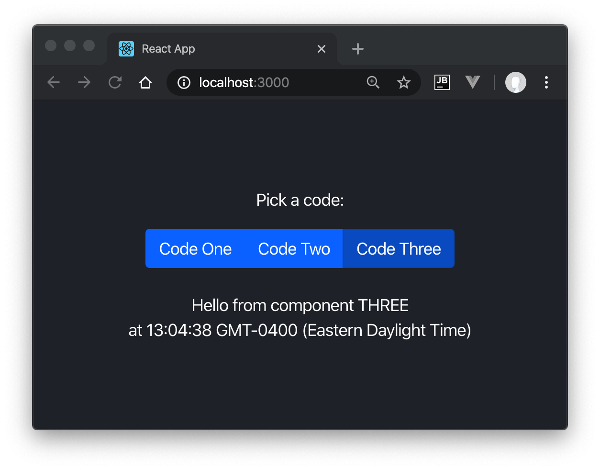

# Dynamic Component Dispatching

This demo addresses a need to dynamically call a React component by a string name.
Approaches using `Eval` or `Function` are not allowed. 

Instead, we use a JavaScript object to map a string key to a component name
in a factory pattern. We could call the resolved component as a function, 
but parameters are props in the React world. Instead, we use a factory that
produces React component instantiations. Here is `RenderFactory.jsx`:

```javascript
import React from 'react';
import RenderOne from '../components/RenderOne';
import RenderTwo from '../components/RenderTwo';
import RenderThree from '../components/RenderThree';

const dispatchCode = (renderer, param) => {
    // To add a component: add its import above; then add a line for its name here:
    const code2Renderer = {
        RenderOne: <><RenderOne param={param}/></>,
        RenderTwo: <><RenderTwo param={param}/></>,
        RenderThree: <><RenderThree param={param}/></>,
    };

    return code2Renderer[renderer] || <>Rats! Code not found</>;
};

export function RenderFactory(props) {
    const { code, param } = { ...props };
    const component = `Render${code}`;

    return dispatchCode(component, param);
}
```

A client component would invoke a child by `code` property string like this:

```javascript
<RenderFactory code={code} param={`at ${new Date().toTimeString()}`}/>
```

The param property is our single parameter, but we could have coded for more
parameters.

Here is one demo dynamic component:

```javascript
import React from "react";

export default function RenderThree(props) {
    const { param } = { ...props };
    return <div>Hello from component THREE<br/>{param}</div>;
}
```

The demo UI chooses the dispatch code property via toggle buttons;



---
# Instructions

This project was bootstrapped with [Create React App](https://github.com/facebook/create-react-app).

## Available Scripts

In the project directory, you can run:

### `yarn start`

Runs the app in the development mode.<br />
Open [http://localhost:3000](http://localhost:3000) to view it in the browser.

The page will reload if you make edits.<br />
You will also see any lint errors in the console.

### `yarn test`

Launches the test runner in the interactive watch mode.<br />
See the section about [running tests](https://facebook.github.io/create-react-app/docs/running-tests) for more information.

### `yarn build`

Builds the app for production to the `build` folder.<br />
It correctly bundles React in production mode and optimizes the build for the best performance.

The build is minified and the filenames include the hashes.<br />
Your app is ready to be deployed!

See the section about [deployment](https://facebook.github.io/create-react-app/docs/deployment) for more information.
